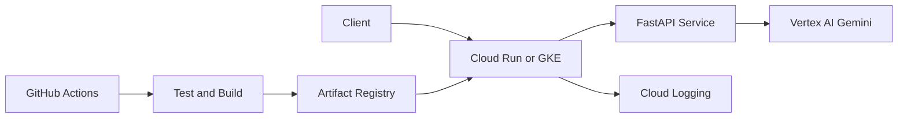

# GCP AI Application Deployment Platform

A production-style reference implementation for deploying a Generative AI API on Google Cloud. It combines a FastAPI service with Gemini on Vertex AI, containerization, automated testing, CI/CD, Cloud Run deployment, optional GKE manifests, and Terraform infrastructure.

> **Portfolio status:** This repository is a reproducible reference implementation. Cloud resources are created only when the deployment commands are run with a configured GCP project.

## Architecture



## Highlights

- FastAPI endpoints for health checks and grounded text generation
- Gemini access through Vertex AI using Application Default Credentials
- Input validation, structured error handling, request IDs, and timeouts
- Docker image designed for Cloud Run's `PORT` contract
- Terraform for Artifact Registry, service accounts, IAM, and Cloud Run
- Kubernetes deployment and service manifests for GKE
- GitHub Actions pipeline for linting, tests, image build, and deployment
- Unit tests that do not require live GCP credentials

## Project Structure

```text
app/
  main.py
  settings.py
  vertex_service.py
tests/
  test_api.py
terraform/
  main.tf
  variables.tf
  outputs.tf
k8s/
  deployment.yaml
  service.yaml
.github/workflows/
  ci-cd.yml
Dockerfile
cloudbuild.yaml
requirements.txt
```

## API

### Health check

```bash
curl http://localhost:8080/health
```

### Generate text

```bash
curl -X POST http://localhost:8080/v1/generate \
  -H "Content-Type: application/json" \
  -d '{"prompt":"Explain RAG in three concise points.","temperature":0.2,"max_output_tokens":256}'
```

## Run Locally

Prerequisites: Python 3.11+, a GCP project with Vertex AI enabled, and Application Default Credentials.

```bash
python -m venv .venv
source .venv/bin/activate
pip install -r requirements.txt
cp .env.example .env
gcloud auth application-default login
uvicorn app.main:app --reload --port 8080
```

Run tests:

```bash
pytest -q
```

## Docker

```bash
docker build -t gcp-ai-api .
docker run --rm -p 8080:8080 \
  -e GOOGLE_CLOUD_PROJECT=your-project-id \
  -e GOOGLE_CLOUD_LOCATION=us-central1 \
  gcp-ai-api
```

## Deploy with Terraform

```bash
cd terraform
terraform init
terraform plan -var="project_id=your-project-id"
terraform apply -var="project_id=your-project-id"
```

The Terraform configuration enables required APIs, creates an Artifact Registry repository and runtime service account, assigns least-privilege Vertex AI access, and deploys the container to Cloud Run.

## Security and Production Notes

- Uses service-account identity rather than embedded keys
- Grants the runtime only Vertex AI User and logging permissions
- Validates prompt length and generation settings
- Keeps secrets and local environment files out of source control
- Supports private Cloud Run access by changing `allow_unauthenticated`
- Production environments should add API authentication, rate limiting, VPC controls, budget alerts, and model-safety policies

## Technology

Python, FastAPI, Gemini, Vertex AI, Google Gen AI SDK, Docker, Cloud Run, GKE, Terraform, GitHub Actions, Pytest.
